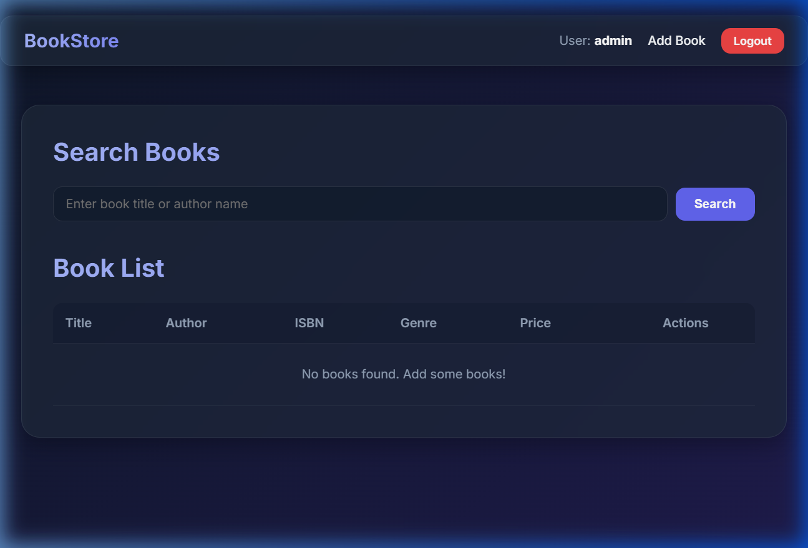
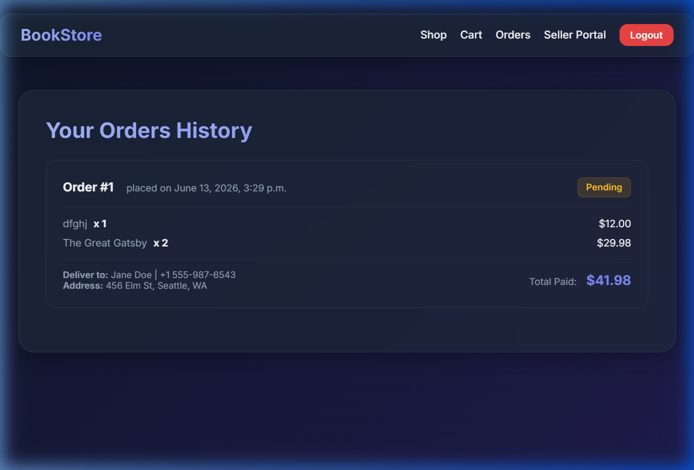

# BookStore E-Commerce & Inventory Platform

A sleek, responsive, and modern bookstore e-commerce web application built using Python, Django, and a custom glassmorphic dark design system.

---

## Key Features

### 🛒 E-Commerce Operations (Buyer View)
- **Interactive Shop Catalog:** Browse books listed by all sellers, with title/author/ISBN search and genre filtering.
- **Shopping Cart:** Add books to cart, increment/decrement quantities, and compute subtotals and grand totals dynamically.
- **Mock Checkout:** Fill in name, contact, and shipping address details to place an order (no actual payment required).
- **Orders History:** View past orders with placement date, item lists, and delivery information.

### 💼 Seller Operations (Seller Portal)
- **Inventory Dashboard:** Manage your own catalog. View only books listed by your logged-in profile.
- **Listing Actions:** Add new books (title, author, ISBN, price, genre), update details of existing listings, or remove them from the store catalog.

---

## UI Screenshots

### Seller Inventory Manager Dashboard


### Placed Orders History


---

## Instructions to Run Locally

### Prerequisites
- Python 3.10+ installed on your system.

### Steps to Run
1. **Navigate to the Project Folder:**
   ```bash
   cd BookStore
   ```

2. **Create and Activate Virtual Environment:**
   - On Windows:
     ```bash
     python -m venv .venv
     .venv\Scripts\activate
     ```
   - On macOS/Linux:
     ```bash
     python3 -m venv .venv
     source .venv/bin/activate
     ```

3. **Install Dependencies:**
   ```bash
   pip install django
   ```

4. **Run Database Migrations:**
   ```bash
   python manage.py makemigrations
   python manage.py migrate
   ```

5. **Start the Development Server:**
   ```bash
   python manage.py runserver
   ```

6. **Access the Application:**
   Open your browser and navigate to [http://127.0.0.1:8000/](http://127.0.0.1:8000/).

---

## Testing Credentials

You can use the following default credentials to test the platform:

| Role | Username | Password |
|---|---|---|
| **Admin (Buyer & Seller)** | `admin` | `adminpass` |
| **Seller** | `seller` | `sellerpass` |
